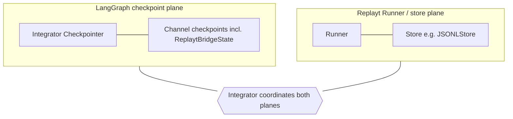

# Checkpoint persistence: scope and failure modes (normative)

This document defines **what is persisted** when using `compile_replayt_workflow(..., checkpointer=...)`, **how in-memory and durable stores differ**, **secret/PII expectations** on serialized graph state, and **failure behavior** for bad or mismatched data. It satisfies the backlog to make checkpoint behavior **explicit before production-minded adoption**.

**Backlog traceability:** Mission Control item **Add LangGraph checkpoint integration slice** maps acceptance criteria and slice boundaries to this file and tests in **[BACKLOG_LANGGRAPH_CHECKPOINT_SLICE.md](BACKLOG_LANGGRAPH_CHECKPOINT_SLICE.md)**. Mission Control item **Durable replayt store vs LangGraph checkpoint: single ownership diagram** (`fae06d2c-c181-4706-b533-f93eb99b8f07`) specifies the operator-facing **two persistence planes** section and README link in **[BACKLOG_DURABLE_REPLAYT_VS_LANGGRAPH_CHECKPOINT.md](BACKLOG_DURABLE_REPLAYT_VS_LANGGRAPH_CHECKPOINT.md)**. Mission Control item **Add optional disk-backed checkpoint round-trip test (SQLite)** (`255db7a8-876d-475d-8c69-cdb5f0c9fcc0`) specifies CI pytest and **`dev`** lockfile obligations in **[BACKLOG_DISK_CHECKPOINT_SQLITE_ROUNDTRIP.md](BACKLOG_DISK_CHECKPOINT_SQLITE_ROUNDTRIP.md)**.

**Relationship to other specs:** Inbound validation of `ReplaytBridgeState` is specified in **[STATE_PAYLOAD_VALIDATION.md](STATE_PAYLOAD_VALIDATION.md)**. Hosted topology, TLS, and IAM-style controls are in **[HOSTED_DEPLOYMENT_AUTHZ.md](HOSTED_DEPLOYMENT_AUTHZ.md)**. Assets and adversaries are summarized in **[THREAT_MODEL.md](THREAT_MODEL.md)**.

---

## 1. Persistence scope: who owns what

| Layer | What may be stored | Owner of format and durability |
| ----- | ------------------ | -------------------------------- |
| **LangGraph channel state** | The graph channels the compiled runnable uses, including the bridge channel shaped as `ReplaytBridgeState` (`context`, `replayt_next`, optional `bridge_state_schema_version`) | **LangGraph** + the integrator-supplied **`Checkpointer`** serialize and store checkpoints. |
| **Bridge validation wrapper** | When `checkpointer=` is not `None`, the bridge wraps the saver so **merged `invoke` / input channel values** are validated **before** LangGraph persists them (see **[STATE_PAYLOAD_VALIDATION.md](STATE_PAYLOAD_VALIDATION.md)**). | This package; behavior locked in `replayt_langgraph_bridge.state_validation`. |
| **Replayt `Runner` / store** | Event logs, approvals, or other data replayt’s APIs persist (e.g. `JSONLStore`) | **replayt** and integrator configuration—not LangGraph checkpoints. |

The bridge **does not** fork replayt or LangGraph persistence. It **does not** define a proprietary checkpoint file format; integrators use **LangGraph 1.1.x–compatible** checkpointers from the ecosystem.

---

## Two persistence planes (LangGraph checkpointer vs replayt Runner / store)

**[BACKLOG_LANGGRAPH_CHECKPOINT_SLICE.md](BACKLOG_LANGGRAPH_CHECKPOINT_SLICE.md) §2** defers treating LangGraph checkpoint durability and replayt **Runner** / **store** durability as the same thing. They are **separate**: a durable graph checkpointer **does not** replace a configured replayt store (event log, approvals, and other replayt-persisted data). A healthy replayt store **does not** by itself give you a LangGraph resume unless you also use a **compatible** **`Checkpointer`**, a consistent **`thread_id`**, and the same compiled graph semantics.

| Plane | What persists | Who owns format and lifecycle |
| ----- | ------------- | ----------------------------- |
| **LangGraph `Checkpointer`** | Serialized **graph channel** state (including **`ReplaytBridgeState`**) | LangGraph + saver stack + integrator backend choice |
| **Replayt `Runner` + store** | Replayt run records (e.g. **`JSONLStore`**), approvals, events | replayt APIs + integrator store path and backup policy |

The two planes use **different bytes and contracts**. The bridge **does not** merge them, migrate one into the other, or ship a default durable backend for either.

**Failure modes by layer** (detail in [§6](#6-failure-modes-corrupt-data-and-version-skew), **[STATE_PAYLOAD_VALIDATION.md](STATE_PAYLOAD_VALIDATION.md)**, and **[HOSTED_DEPLOYMENT_AUTHZ.md](HOSTED_DEPLOYMENT_AUTHZ.md)**):

- **LangGraph checkpointer and serialized graph state** — Blob corruption or deserialization failures surface from LangGraph or the saver implementation; **LangGraph** / checkpoint **format skew** across versions; wrong or reused **`thread_id`** breaking resume; remote or hosted backends add **network, TLS, and ACL** risk (**[HOSTED_DEPLOYMENT_AUTHZ.md](HOSTED_DEPLOYMENT_AUTHZ.md)**).
- **Bridge inbound validation** (when `checkpointer=` is set) — Invalid dict-shaped channel values → **`BridgeStateValidationError`** before handlers run; **no** new checkpoint from that rejected **`invoke`** (**[STATE_PAYLOAD_VALIDATION.md](STATE_PAYLOAD_VALIDATION.md)**).
- **Replayt Runner / store** — Store loss or corruption; **workflow definition** changes versus old run data; replayt-level resume errors **independent** of LangGraph checkpoint bytes; **integrator** responsibility for paths, permissions, backup, and migration (no unified migration across planes from this package).

---

## 3. In-memory vs durable checkpointers

| Class | Typical use | Durability | Production notes |
| ----- | ----------- | ---------- | ------------------ |
| **In-memory** (e.g. LangGraph `MemorySaver` or equivalent process-local stores) | Unit tests, local debugging, single-process demos | **Ephemeral** — lost on process exit | Appropriate for CI and deterministic tests **without** live credentials. **Not** a multi-tenant or durable production store. See **[HOSTED_DEPLOYMENT_AUTHZ.md — §1](HOSTED_DEPLOYMENT_AUTHZ.md#1-supported-deployment-topologies-and-required-controls)** (T1 vs T2+). |
| **Durable** (e.g. SQLite file on disk, PostgreSQL, managed object store behind a LangGraph-supported saver) | Staging/production, resume across restarts | **Survives** process restarts per backend | Requires filesystem ACLs, TLS to remote stores, least-privilege IAM, and environment separation as in **HOSTED_DEPLOYMENT_AUTHZ**. |

**Disk-backed CI coverage:** Maintainers are adding a **SQLite-oriented** round-trip pytest under Mission Control backlog **`255db7a8-876d-475d-8c69-cdb5f0c9fcc0`**; acceptance, lockfile, and platform notes live in **[BACKLOG_DISK_CHECKPOINT_SQLITE_ROUNDTRIP.md](BACKLOG_DISK_CHECKPOINT_SQLITE_ROUNDTRIP.md)** and §7 below.

**Default:** `compile_replayt_workflow(workflow)` uses `checkpointer=None` — **no** LangGraph checkpoint saver supplied by the bridge. That is **not** durable graph threading; integrators opt in explicitly.

---

## 4. Supported checkpointer backends (this release line)

**Declared integration target** (see `pyproject.toml` and **[DESIGN_PRINCIPLES.md](DESIGN_PRINCIPLES.md#dependency-and-pin-policy)**): **langgraph `>=1.1.0,<1.2`**.

**Supported pattern (normative for integrators):** Any **`Checkpointer`** implementation that is **compatible with the LangGraph 1.1.x** `CompiledGraph` API you use (same major.minor line as this package’s dependency range). Concrete classes (e.g. in-memory savers, SQLite, Postgres) ship with or alongside **langgraph** / **langgraph-checkpoint**; the exact list and configuration belong to **upstream documentation** (see links in **[HOSTED_DEPLOYMENT_AUTHZ.md](HOSTED_DEPLOYMENT_AUTHZ.md)**).

**What this package does *not* do:**

- Ship or endorse a single “official” third-party database or cloud backend.
- Guarantee behavior outside the declared **langgraph** range; a new LangGraph major may change checkpoint APIs or serialization.
- Encrypt or decrypt checkpoint blobs; **encryption at rest and in transit** is entirely between the integrator and their chosen backend (**[THREAT_MODEL.md](THREAT_MODEL.md#5-explicit-non-goals)**).

**Known limitations (summary):**

1. **No default durable checkpoint** — persistence is off unless you pass `checkpointer=`.
2. **Checkpoint contents mirror graph state** — anything placed in `ReplaytBridgeState["context"]` may appear in serialized checkpoints (see §5).
3. **Upstream deserialization** — LangGraph / checkpoint libraries control replay of stored blobs; follow upstream **security** and **persistence** docs for the versions you run (including hardening options such as strict msgpack, where applicable — pointers in **HOSTED_DEPLOYMENT_AUTHZ**).
4. **Bridge validation is boundary-scoped** — it validates **dict-shaped inbound channel state** at defined entry points; it does **not** implement a full forensic audit of arbitrary on-disk corruption inside proprietary checkpoint encodings.

---

## 5. Secrets, PII, and serialized state

- **Checkpoint serialization** includes LangGraph’s view of channel values. Treat **`ReplaytBridgeState`** as **persistence-bound**: do not place secrets or sensitive PII in `context` unless your storage, retention, and access policies explicitly allow it.
- **Shallow merge** of `context` across updates (see **[THREAT_MODEL.md](THREAT_MODEL.md)**) limits some accidental propagation patterns but does **not** prevent intentional storage of sensitive fields.
- **Bridge log redaction** (**[LOG_REDACTION.md](LOG_REDACTION.md)**) applies to **bridge-originated structured logs**, **not** to checkpoint file contents or LangGraph-internal logging.

For a deny-oriented list of unsafe field categories, see **[THREAT_MODEL.md — Unsafe fields](THREAT_MODEL.md#6-unsafe-fields)**.

---

## 6. Failure modes: corrupt data and version skew

Behavior is split between **bridge-owned validation** and **upstream / integrator-owned** layers.

### 6.1 Inbound bridge state (bridge — fail closed)

Per **[STATE_PAYLOAD_VALIDATION.md](STATE_PAYLOAD_VALIDATION.md)**:

- **Unknown or unsupported `bridge_state_schema_version`**, oversize or malformed `context`, disallowed types, cycles, etc. → **`BridgeStateValidationError`** (subclass of `ValueError`) with **generic, stable** public messages.
- **No workflow step handler runs** from that rejected payload, and **no new durable checkpoint** attributable to that rejected invocation (see **STATE_PAYLOAD_VALIDATION §6**).

This is the **fail closed** guarantee for **untrusted dict-shaped** bridge state at the validation boundary.

### 6.2 LangGraph checkpoint blob corruption or deserialization failure

If storage is corrupted, truncated, or incompatible with the **LangGraph / checkpointer** version in use, errors are raised by **LangGraph or the saver implementation**, not by a dedicated bridge type. The bridge does **not** promise automatic repair or migration of arbitrary checkpoint bytes.

**Integrator expectation:** Treat such failures as **fatal for that thread** unless upstream APIs document recovery; restore from backup or discard the checkpoint namespace.

### 6.3 Version skew matrix

| Skew | Detection / failure surface | Fail closed? |
| ---- | --------------------------- | -------------- |
| **Unsupported `bridge_state_schema_version`** on inbound channel dict | `BridgeStateValidationError` before handlers / persistence (bridge) | **Yes** (for that invoke) |
| **Newer bridge** reading **older** schema version still in the supported set | Should load; forward compatibility is **best effort** per **[STATE_PAYLOAD_VALIDATION.md — §3](STATE_PAYLOAD_VALIDATION.md#3-schema-version)** |
| **Older bridge** reading **newer** persisted state | May lack fields or semantics → validation or runtime errors; integrators should **align bridge and langgraph versions** with deployments |
| **LangGraph checkpoint format** change across upstream versions | Deserialization or runtime errors from LangGraph / checkpoint stack | **Integrator** must not mix checkpoint stores across incompatible LangGraph lines |
| **Replayt workflow graph** changed while old checkpoints exist | Possible undefined behavior or replayt errors when resuming | **Integrator** responsibility to migrate or invalidate old threads |

### 6.4 Routing and transition errors

**Routing / transition** failures from the bridge raise **`BridgeRoutingError`** / **`BridgeTransitionError`** (see **[GRAPH_CONSTRUCTION_ERRORS.md](GRAPH_CONSTRUCTION_ERRORS.md)**). Their `str(exception)` values may include **step names** and allowed targets to aid debugging (**[THREAT_MODEL.md](THREAT_MODEL.md)**). These are separate from **inbound state validation** errors.

---

## 7. Builder-facing acceptance checklist (tests + docs)

Map the product backlog to verifiable items:

- [x] **Docs (this file):** Supported checkpointer **pattern** for langgraph **1.1.x**, in-memory vs durable, limitations, secret/PII, corrupt/skew failure modes, cross-links to **STATE_PAYLOAD_VALIDATION**, **HOSTED_DEPLOYMENT_AUTHZ**, **THREAT_MODEL**.
- [x] **Tests (in-memory):** At least **one** deterministic path using a **non-network** checkpointer (e.g. **`MemorySaver`**) with **no** optional **`demo`** extra and **no** live cloud/API credentials, demonstrating either:
  - a full **`invoke`** that leaves the graph in an expected terminal channel state while checkpoints are enabled, **or**
  - an explicit **resume** / second interaction that depends on a **prior** checkpoint for the same `thread_id`.
- [ ] **Tests (disk / SQLite):** Per **[BACKLOG_DISK_CHECKPOINT_SQLITE_ROUNDTRIP.md](BACKLOG_DISK_CHECKPOINT_SQLITE_ROUNDTRIP.md)** — **SQLite**-oriented (or documented equivalent disk-backed) saver, **process or re-compile boundary** where feasible, same default CI / **`[dev]`** / **`uv.lock`** contract. When implemented, add a short note here (§3 or this §7 bullet) on **CI platform assumptions** (temp paths, single-threaded scope, Windows vs Linux if relevant).

**Existing baseline (maintainers must keep coverage green):** `tests/test_bridge_graph.py` (`MemorySaver` + `invoke` linear workflow; `test_resume_second_invoke_uses_memory_checkpointer` for two-`invoke` resume) and `tests/test_state_payload_validation.py` (checkpoint non-advance on bad inbound state, resume-related assertions) illustrate allowed patterns. When touching these behaviors, **reference this document** in the test module or function docstring so traceability stays obvious.

- [x] **README / API.md / THREAT_MODEL** — Links to this spec (see §8).

---

## 8. Related documents

- **[STATE_PAYLOAD_VALIDATION.md](STATE_PAYLOAD_VALIDATION.md)** — Inbound dict validation, schema version, no partial checkpoint on reject.
- **[HOSTED_DEPLOYMENT_AUTHZ.md](HOSTED_DEPLOYMENT_AUTHZ.md)** — Topologies T1–T5, TLS, IAM, upstream persistence links.
- **[THREAT_MODEL.md](THREAT_MODEL.md)** — Assets, adversaries, unsafe fields, non-goals.
- **[LOG_REDACTION.md](LOG_REDACTION.md)** — Logging only; not checkpoint contents.
- **[REPLAYT_BOUNDARY_TESTS.md](REPLAYT_BOUNDARY_TESTS.md)** — Replayt-facing test style; LangGraph checkpoint tests may live alongside but are **not** a substitute for this persistence contract.
- **[BACKLOG_HITL_INTERRUPT_COOKBOOK.md](BACKLOG_HITL_INTERRUPT_COOKBOOK.md)** — Spec and acceptance criteria for **`interrupt_before` / `interrupt_after`** integrator cookbook and CI coverage (Mission Control backlog `4b64a655-bb06-49e5-8912-61b06626a034`).
- **[BACKLOG_DURABLE_REPLAYT_VS_LANGGRAPH_CHECKPOINT.md](BACKLOG_DURABLE_REPLAYT_VS_LANGGRAPH_CHECKPOINT.md)** — Spec and acceptance criteria for the **two persistence planes** diagram / table and layered failure modes (Mission Control backlog `fae06d2c-c181-4706-b533-f93eb99b8f07`).
- **[BACKLOG_DISK_CHECKPOINT_SQLITE_ROUNDTRIP.md](BACKLOG_DISK_CHECKPOINT_SQLITE_ROUNDTRIP.md)** — Spec and acceptance criteria for **disk-backed** (SQLite-oriented) checkpoint round-trip pytest on default CI (Mission Control backlog `255db7a8-876d-475d-8c69-cdb5f0c9fcc0`).
